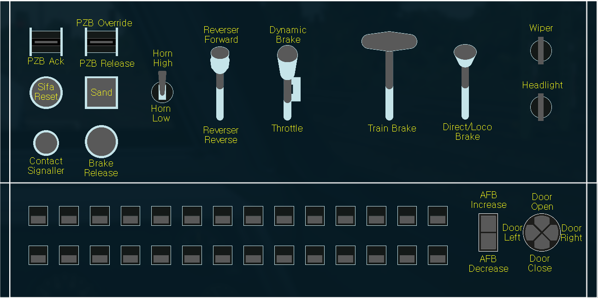

# TSW-RailDriver-Remap

A RailDriver Remapping mods for Train Sim World.
The final goal is remapping buttons and levers to make the users to use RailDriver more comfortable and fix issues in default RailDriver mapping.
Especially, some German locomotives have different controls between different routes even though they are the same locomotives.

Therefore, I tried to set the buttons and levers as similar as possible between the locomotives from the same nations.

Currently it supports German and Czech locomotives.

This work is still in progress and alpha-level.
If you want to contribute or experiencing an issue, please see [Contributing](#contributing).

Some controls refer to Roman72's RailDriver Remapping.
Check out their [works](https://www.trainsimcommunity.com/user/486412-roman72/uploads) if you want!

## To install

To install the mods, just copy the `.pak` files in `Build/` directory to TSW DLC directory.
Each pak file contains every routes for each locomotives.
For example, DB BR 143 pak supports every available routes.

For Steam, copy to
```
<directory_to_steam>/steamapps/common/Train Sim World 6/WindowsNoEditor/TS2Prototype/Content/DLC
```

For remapped buttons and levers, visit [Remapped Buttons & Levers](#remapped-buttons--levers).

## Supported Locomotives

This mods supports the locomotives listed in below.
I will keep adding more locomotives.

Some buttons in the index may not work for some locomotives.
They are 1) To-Do list or 2) disabled/not supported for some locos.
For example, for some newer DB BR 143, reverser handle can be removed/inserted but older ones are not.

### Germany

The listed locomotives below contains the other liveries (e.g., DBB, MRCE, RailPool or FlixTrain).

#### Electric Locomotives

* DB BR 101
* DB BR 101 Expert and DB BR 286
* DB BR 103
* DB BR 110
* DB BR 111
* DB BR 112
* DB BR 114
* DB BR 140
* DB BR 143
* DB BR 145 Expert
* DB BR 146
* DB BR 147
* DB BR 155
* DB BR 182
* DB BR 185
* DB BR 187
* DB BR 193 Vectron
* DB BR 194 (E94) Crocodile

#### Diesel Locomotives

* DB BR 204
* DB BR 218
* DB BR 294
* DB G6

#### Cab Cars

* DB DoppelStockwagen (DB BR 766 and 767)
* DB BR 463 Electric
* DB BR 463 Diesel
* DB BR 483

#### EMUs

* DB BR 401 ICE 1
* DB BR 403 ICE 3
* DB BR 406 ICE 3M
* DB BR 411 ICE T (DB BR 415)
* DB BR 422
* DB BR 423
* DB BR 425
* DB BR 430
* DB BR 442 Talent 2 (include BR 1442 in Rapid Transit)

#### DMUs

* DB BR 612
* DB BR 628
* DB BR 642

### Czech

Czech locomotives do not support RailDriver originally.
Therefore, I overrides NJ Bi-level cab car and SD40-2 with training center livery.
It may not affect the other liveries (i.e., NJ transit, CSX and UP).

CD 750 and CD 843 are refer to the Roman72's RailDriver Remapping a lot.
To check their Czech remapping, visit [their upload](https://www.trainsimcommunity.com/mods/c3-train-sim-world/c109-other/i6921-tsw6-raildriver-remapping).

* CD 750
* CD 843

### Austria

Some Austrian locomotives shares same vehicle with Germany (e.g., ÖBB 1116 and DB BR 182), but the remapping is slightly different.

* ÖBB 1020 Crocodile
* ÖBB 1116 Taurus
* ÖBB 4024 Talent 1

### France

* TGV Duplex 200

## Remapped Buttons & Levers

The index of remapped buttons are stored in `raildriver-*-Remapped.docx`.
You may print out them and put on your controller.

For levers, I tried to assign same functions for same levers as possible.

### Germany

See the image below.
For the buttons in bottom, see `raildriver-Germany-Remapped.docx` file.

`Headlight` knob controls the 'brightness' of the headlight (i.e., reduced or bright).
To change the 'signal' light (i.e., white or red), see `raildriver-Germany-Remapped.docx` for each locomotive.

For door control, I only seperate 'Door Selector' and 'Door Close/Open' for supported locomotives.
For the others, I just used default door control buttons (Left/Right Door Unlock/Lock).
This issue is not my side; each locomotive uses different key index for door control internally.
I will fix them when I found out how to assign door control for them.



## Roadmaps
I don't have a roadmap with exact date, but I have a simple plan to add the remaps.

1. German electric locomotives ... :heavy_check_mark:
2. German cab cars ... :heavy_check_mark:
3. German EMUs ... :heavy_check_mark:
4. German DMUs ... :heavy_check_mark:
5. German diesel & shunting locomotives ... :heavy_check_mark:
6. Austria/France/Switzerland/Netherland ... :construction:
7. UK
8. USA

## Directory Structures

* `Build`: Compiled `.pak` files. Copy them into TSW directory.
* `Mods`: Mods meta-data used in TSW Editor.
* `Plugins`: Raw data assets of remappings. Modify them with TSW Editor if you want to contribute.
* `Saved`: Scripts and required files to build mods.

* `index.odp`: Index file contains some information when creating remaps. Written with libreoffice.
* `raildriver-*-Remapped.docx`: Index of remapped buttons for each locomotive.

## Contributing

### Github Issues

Please feel free to add Github Issue if you are experiencing a bug or have a feedback.

### Direct Contribution

If you want to contribute directly, visit our [wiki](https://github.com/FreddyYJ/TSW-RailDriver-Remap/wiki) to setup your environment, modify the assets and build the mod!