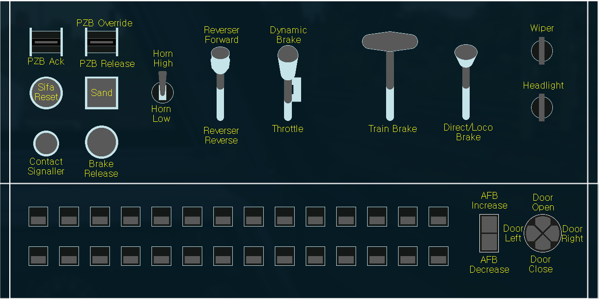

# TSW-RailDriver-Remap

A RailDriver Remapping mods for Train Sim World.
The final goal is remapping buttons and levers to make the users to use RailDriver more comfortable and fix issues in default RailDriver mapping.
Especially, some German locomotives have different controls between different routes even though they are the same locomotives.

Therefore, I tried to set the buttons and levers as similar as possible between the locomotives from the same nations.

See below to check supported nations.

* Germany
* Austria
* Czech
* France
* Switzerland
* Netherland

This work is still in progress and alpha-level.
If you want to contribute or experiencing an issue, please see [Contributing](#contributing).

## To install

To install the mods, just copy the `.pak` files in `Build/` directory to TSW DLC directory.
Each pak file contains every routes for each locomotives.
For example, DB BR 143 pak supports every available routes.

For Steam, copy to
```
<directory_to_steam>/steamapps/common/Train Sim World 6/WindowsNoEditor/TS2Prototype/Content/DLC
```

For remapped buttons and levers, visit [Remapped Buttons & Levers](#remapped-buttons--levers).

## Supported Locomotives

This mods supports the locomotives listed in below.
I will keep adding more locomotives.

Some buttons in the index may not work for some locomotives.
They are 1) To-Do list or 2) disabled/not supported for some locos.
For example, for some newer DB BR 143, reverser handle can be removed/inserted but older ones are not.

### Germany

The listed locomotives below contains the other liveries (e.g., DBB, MRCE, RailPool or FlixTrain).

#### Electric Locomotives

* DB BR 101
* DB BR 101 Expert
* DB BR 103
* DB BR 110
* DB BR 111
* DB BR 112
* DB BR 114
* DB BR 140
* DB BR 143
* DB BR 145 Expert
* DB BR 146
* DB BR 147
* DB BR 155
* DB BR 182
* DB BR 185
* DB BR 187
* DB BR 193 Vectron
* DB BR 194 (E94) Crocodile

#### Diesel Locomotives

* DB BR 204
* DB BR 218
* DB BR 294
* DB G6

#### Cab Cars

* DB BR 286 Bpmmbdzf
* DB Doppelstockwagen (DB BR 766 and 767)
* DB BR 463 Electric
* DB BR 463 Diesel
* DB BR 483

#### EMUs

* DB BR 401 ICE 1
* DB BR 403 ICE 3
* DB BR 406 ICE 3M
* DB BR 411 ICE T (DB BR 415)
* DB BR 422
* DB BR 423
* DB BR 425
* DB BR 430
* DB BR 442 Talent 2 (include BR 1442 in Rapid Transit)

#### DMUs

* DB BR 612
* DB BR 628
* DB BR 642

### Czech

* CD 750
* CD 843

### Austria

Some Austrian locomotives shares same vehicle with Germany (e.g., ÖBB 1116 and DB BR 182), but the remapping is slightly different.

* ÖBB 1020 Crocodile
* ÖBB 1116 Taurus
* ÖBB 4024 Talent 1

### France

* TGV Duplex 200

### Switzerland

* RABe 523
* RhB GE 4/4 II (Including anniversary liveries)
* RhB 8/12 Allegra

### Netherland

* NS ICM3
* NS SNG3

### UK

The listed locomotives and MUs below contain every kind of liveries.

#### Diesel Locomotives

* Class 08/09
* Class 20
* Class 31
* Class 33
* Class 37
* Class 40
* Class 45
* Class 47
* Class 52
* Class 66

#### Electric Locomotives

* Class 86
* Class 87
* Class 90

#### Steam Locomotives

* LMS Steam Locomotives (Fowler 4F, Stanier 8F and Jubilee)
* LMS Flying Scotsman

#### DMUs

* Class 43 HST (Class 125)
* Class 101
* Class 142
* Class 150
* Class 153
* Class 158
* Class 165/166
* Class 170/171
* Class 220

#### EMUs

* 1938 Tube Stock
* 1972 Tube Stock
* Class 313
* Class 314
* Class 323
* Class 350
* Class 375
* Class 377
* Class 378
* Class 380
* Class 385
* Class 387
* Class 390
* Class 465
* Class 483
* Class 484
* Class 700
* Class 710
* Class 801
* Class 802
* Class 805/807

### USA

Currently USA routes does not have any EMUs.

#### Diesel Locomotives

GP38-2 has different key and control depends on the livery.

* GP60M (BNSF H2, H4)
* AC4400CW (CSX, UP)
* ES44C4 (BNSF)
* SD70ACe (BNSF, UP, UP Heritage)
* C40-8W (ATSF, CSX)
* ES44AC (NS, NS Heritage)
* F7 (ATSF, CRR)
* GP38-2 CSX/UP
* GP38-2 NS
* GP38-2 CN
* GP9RM (CN)
* SD40 (CRR, CSX) (CSX SD40-2 not included)
* SD40-2 (CSX, UP, ATSF, BNSF)
* MP15DC (Caltrain)
* F40PH-2CAT (Caltrain)
* MP36PH-3C (Caltrain, Metrolink)
* F125 (Metrolink)
* F59PHR (Metrolink)
* F40PH-3C (MBTA)
* HSP46 (MBTA)

#### Electric Locomotives

* ACS-64 (Amtrak)
* ALP-45DP (NJT)
* ALP-46 (NJT)

#### Cab Cars

* Gallery Cab Car (Caltrain)
* Bombardier Bi-Level Cab Car (Caltrain)
* Rotem Bi-Level Cab Car (Metrolink)
* CTC-3 (MBTA)
* CTC-5 (MBTA)
* Amfleet Cab Car (Amtrak)
* Multi-Level Commuter Cab Car (NJT)

#### EMUs

* Arrow III (NJT)
* Acela (Amtrak)
* M3/M3A (LIRR, MNRR)

## Remapped Buttons & Levers

The index of remapped buttons are stored in `raildriver-*-Remapped.docx`.
You may print out them and put on your controller.

For levers, I tried to assign same functions for same levers as possible.

Door controls are in 4-direction crossed buttons, in right bottom.
If the locomotive supports in-cab door control, it will use them.
Otherwise, it will lock/unlock left/right doors (i.e., same as Y and U in keyboard).

### Germany and Austria

See the image below.
For the buttons in bottom, see `raildriver-Germany-Remapped.docx` file.

If the locomotive only has Door Control without Door Selector (especially the old electric locomotives such as DB BR 103), it will automatically decide the direction of the door.
Therefore, if you set Door Control to Open (up direction), the direction of the door is decided by the direction of the platform.
For example, if the platform is on your left, Door Control to Open will open the left doors only and vice versa.
For those locos, Door Selector buttons (left and right button in right bottom crossed buttons) to Left/Right Door Unlock/Lock (Y and U in keyboard).

`Headlight` knob controls the 'brightness' of the headlight (i.e., reduced or bright).
To change the 'signal' light (i.e., white or red), see `raildriver-Germany-Remapped.docx` for each locomotive.

#### Door Control

If the locomotive has both 'Door Selector' and 'Door Close/Open' (e.g., DB BR 146 or DB Doppelstockwagen), use left/right buttons are for Door Selector, up for door open, and down for door close.

If the locomotive has 'Door Selector' only (e.g., DB BR 101 or DB BR 403 ICE 3), use left/right buttons.
The doors will be opened automatically when you select a door.
To close, move Door Selector to 'Lock All'.

If the locomotive or MU has open left/right and close button, use left/right buttons to open the door.
To close, use down button.

If the locomotive has 'Door Control (Close/Open)' only (e.g., DB BR 103 or DB BR 463), use up for door open and down for door close.
It will automatically decide the direction of the door by the direction of the platform.
For example, if the platform is in left, 'Door Open' will open the left doors, not right doors.
If you want to open/close specific direction, use left/right button.
If will lock/unlock left/right doors (i.e., same as Y and U in keyboard).



### The Others

The other locomotives from the other countries uses same control with Germany and Austria except PZB controls and Brake Release.

## Roadmaps
I don't have a roadmap with exact date, but I have a simple plan to add the remaps.

1. German electric locomotives ... :heavy_check_mark:
2. German cab cars ... :heavy_check_mark:
3. German EMUs ... :heavy_check_mark:
4. German DMUs ... :heavy_check_mark:
5. German diesel & shunting locomotives ... :heavy_check_mark:
6. Austria/France/Switzerland/Netherland ... :heavy_check_mark:
7. UK ... :heavy_check_mark:
8. USA ... :construction:
9. Japan

## Directory Structures

* `Build`: Compiled `.pak` files. Copy them into TSW directory.
* `Mods`: Mods meta-data used in TSW Editor.
* `Plugins`: Raw data assets of remappings. Modify them with TSW Editor if you want to contribute.
* `Saved`: Scripts and required files to build mods.

* `index.odp`: Index file contains some information when creating remaps. Written with libreoffice.
* `raildriver-*-Remapped.docx`: Index of remapped buttons for each locomotive.

## Contributing

### Github Issues

Please feel free to add Github Issue if you are experiencing a bug or have a feedback.

### Direct Contribution

If you want to contribute directly, visit our [wiki](https://github.com/FreddyYJ/TSW-RailDriver-Remap/wiki) to setup your environment, modify the assets and build the mod!